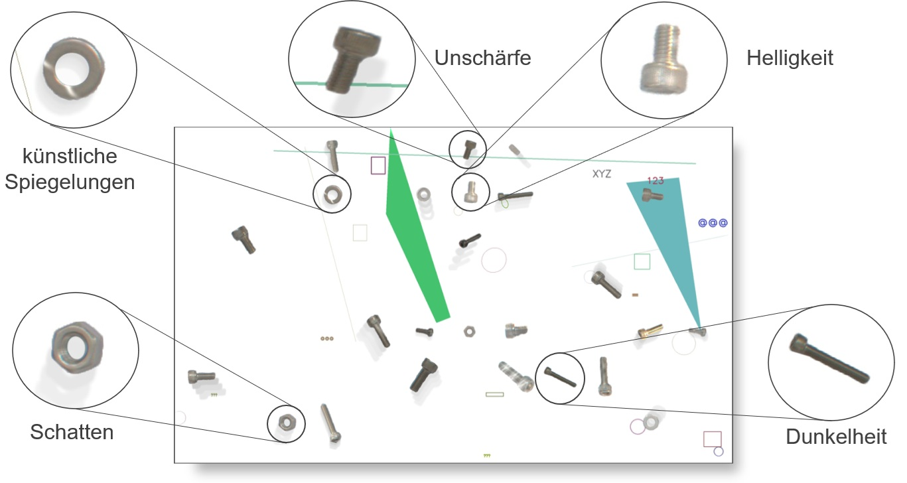
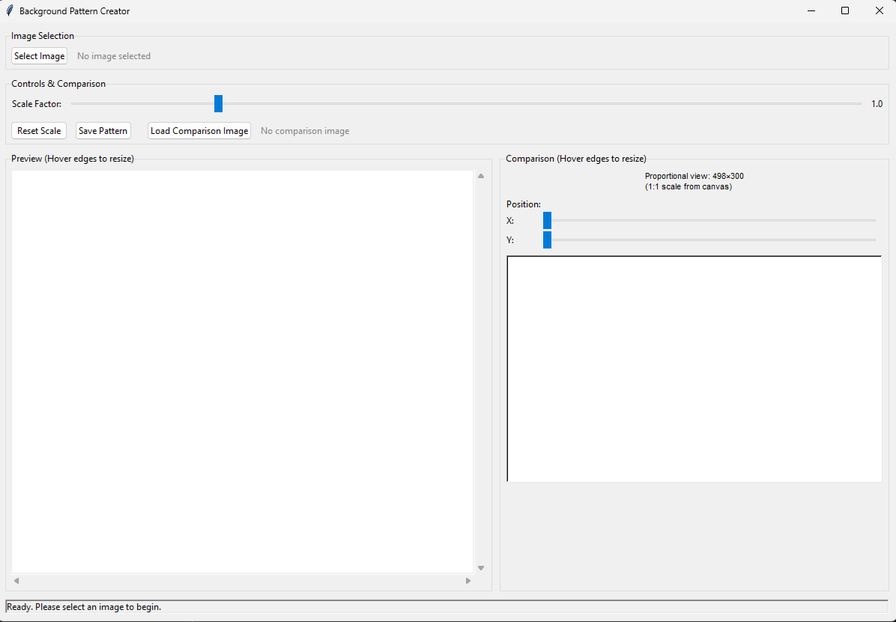
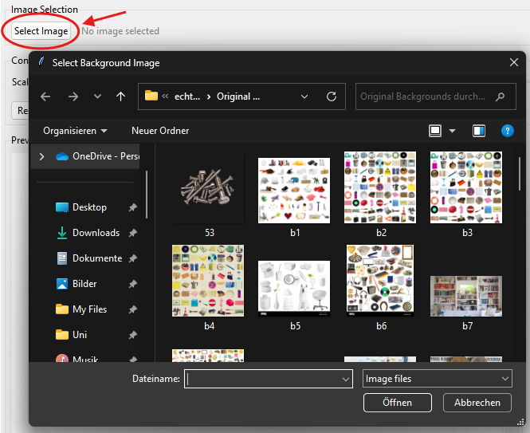
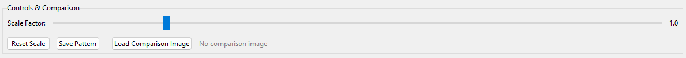
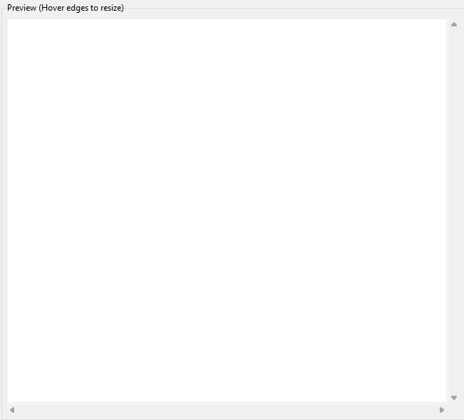
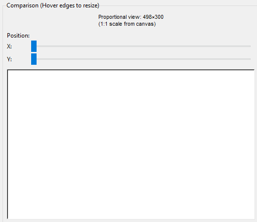
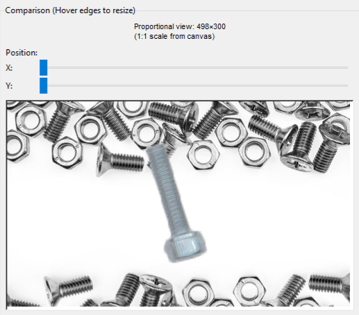
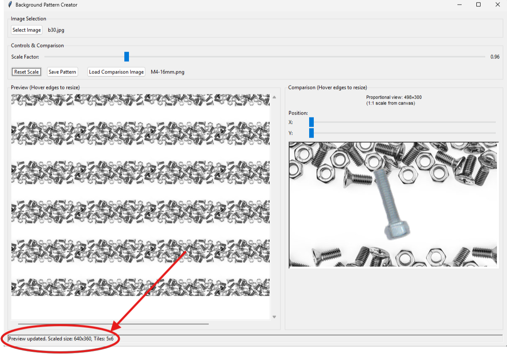
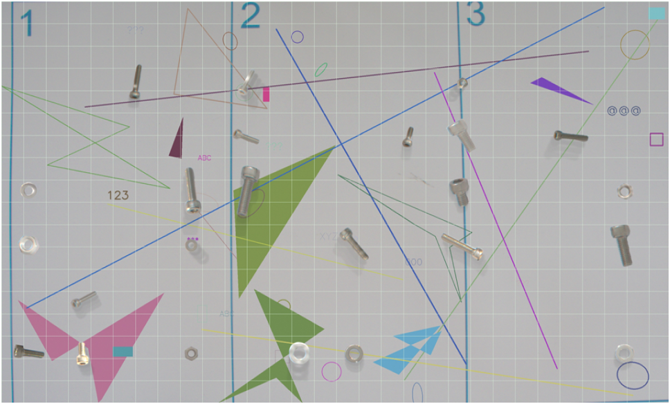
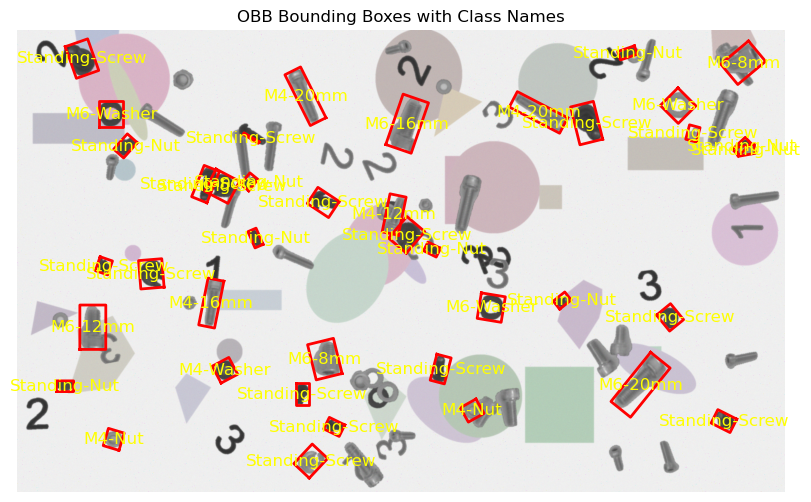

# Augmentation Guide
The following shows three ways to generate synthetic images:

- **Background Pattern Creator (Variant 1)** 
- **Variant 2 Python code**

An example of the current effects used in the generation is shown below:

## Background Pattern Creator - User Interface Documentation

### Overview Background Pattern Creator

The Background Pattern Creator is a GUI application built with Python Tkinter that allows users to create tiled background patterns from individual images. The tool is specifically designed to generate backgrounds with dimensions of 3076×1852 pixels, making it ideal for creating consistent background patterns for computer vision and image processing applications.

### Interface Components

#### 1. Image Selection Section

The top section of the interface handles image loading and file management.

**Components:**

- **Select Image Button**: Opens a file dialog to choose background images
- **File Label**: Displays the currently selected image filename

**Supported File Formats:**

- PNG files (*.png)
- JPEG files (*.jpg, *.jpeg)
- BMP files (*.bmp)
- TIFF files (*.tiff)
- GIF files (*.gif)

#### 2. Controls & Comparison Section

This section provides the main controls for pattern manipulation and comparison functionality.

##### Scale Controls
- **Scale Factor Slider**: Adjusts the size of the base image from 0.1× to 5.0×
- **Scale Value Display**: Shows the current scale factor numerically
- **Reset Scale Button**: Instantly returns scale to 1.0×

##### Action Buttons
- **Save Pattern Button**: Exports the current pattern as a high-resolution image
- **Load Comparison Image Button**: Loads an image for overlay comparison
- **Comparison Label**: Shows the filename of the loaded comparison image

#### 3. Preview Section (Resizable)

The main preview area shows how the tiled pattern will look at the target resolution.

**Features:**

- **Resizable Canvas**: Hover near edges to see resize cursors
- **Mouse Resize**: Click and drag edges/corners to resize the preview area
- **Scrollbars**: Navigate through the full pattern when it's larger than the display area
- **Real-time Updates**: Pattern updates automatically when scale changes

**Resize Interactions:**

- Hover near edges (within 8 pixels) to see resize cursors
- Click and drag to resize canvas dimensions

#### 4. Comparison Section (Resizable)

The right panel provides a detailed view of a specific area of the pattern with comparison capabilities.

##### Position Controls
- **X Position Slider**: Horizontally moves the comparison viewport
- **Y Position Slider**: Vertically moves the comparison viewport
- **Info Label**: Shows current comparison area dimensions and scale

##### Comparison Canvas
- **Proportional View**: Maintains the correct aspect ratio of the target pattern
- **Resizable**: Use mouse to resize the comparison view
- **Overlay Support**: Displays comparison images centered in the view
- **Scale Range**: 0.5× to 2.0× for detailed inspection

#### 5. Status Bar

The bottom status bar provides real-time feedback about the application state.

**Information Displayed:**

- Current image filename and dimensions
- Scale factor and tile count
- Operation status (loading, saving, errors)
- File save confirmations

### Usage Workflow

#### Basic Pattern Creation

**1. Load Background Image**

- Click "Select Image" button
- Navigate to your background images
- Select desired background image

**2. Adjust Scale**

- Use the scale slider to resize the base image
- Preview updates automatically
- Observe tile count in status bar

**3. Preview and Refine**

- Resize preview canvas if needed for better visibility
- Use scrollbars to examine different areas
- Adjust scale until satisfied with pattern

**4. Save Pattern**

- Click "Save Pattern" button
- Choose location and filename
- Select format (PNG recommended for quality, JPEG for smaller files)

#### Advanced Features: Comparison Mode

**1. Load Comparison Image**

- Click "Load Comparison Image" button
- Select an object or component image
- Image appears centered in comparison view

**2. Position Comparison Area**

- Use X and Y position sliders to move the comparison viewport
- Find optimal background areas for your objects
- Resize comparison canvas for detailed inspection

**3. Evaluate Placement**

- Observe how objects appear against the background pattern
- Assess visibility and contrast
- Adjust background scale if needed for better object definition

#### Example Image

## Variant 2 Python code
### Current Augementations
- background objects (simple shapes and everyday objects)
- rotation, translation
- M6 and M4 screws, nuts and washers
- other screws, nuts and washers

### Example of generated images

### Usage
You can generate synthetic images using the synthetic_variants.variants_2.image_creation function showcased in the code/synthetic_variants/variants2/variants2_examples.py file.

### Functions
::: synthetic_variants.variants_2.image_creation

