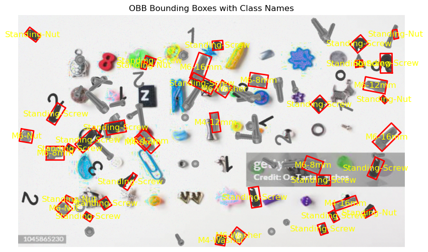

# Augmentation Guide

## Current Augementations
- background objects (simple shapes and everyday objects)
- rotation, translation
- other screws
- blur (not active)
- noise (not active)

## Example of generated images

## Functions
::: image_creation