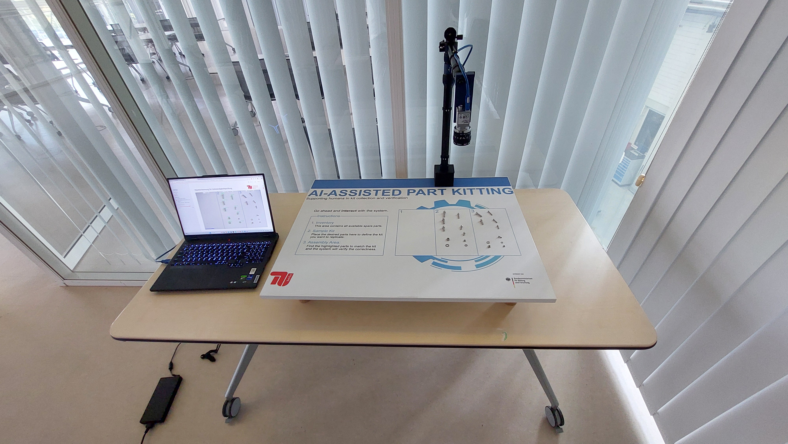

# Demonstrator Project Documentation

Welcome to the documentation of the **Demonstrator Student Project**, developed as part of the [ProKI Project](https://www.tu.berlin/iat/forschung/projekte/proki-netz#c2329888).

---

## 📚 Documentation Overview

This documentation is divided into two main sections:

### 1. Setup Instructions for demonstrations
The setup and usage guides provide a step-by-step guide on how to:

- Mechanically assemble the demonstrator
- Set up the required software
- Prepare and use the demonstrator in a live or showcase setting

### 2. Software Backend & Model Training  
The training, augementation, and streamlit guides provide:

- The architecture and components of the software backend
- The training pipeline for the computer vision model used in the demonstrator
- Devolped Tools involved in the data augmentation process
- The current performance of the used model

---

## 🔗 About the Project

This student project is part of the [ProKI Initiative](https://www.tu.berlin/iat/forschung/projekte/proki-netz#c2329888), which aims to explore and promote the use of AI in industrial applications. The demonstrator serves as a practical tool for showcasing computer vision and automation concepts in a tangible, hands-on way. This documentaion was devopled in the student project to help users to setup and futher develope the demonstrator and therfore **robustify** the existing demonstrator and make it more **portable**, enabling its use in various showcase and demonstration environments.

---

## 🚀 Get Started

Use the navigation on the left to explore the setup instructions or dive into the training process to further develop the demonstrator.

---

## 📁 Project Layout
    demonstrator/
    -app.py # The streamlit code
    -enviornment.yml # The python envrionment specification
    -checkpoints/ # The trainined object dection models
    -code/ # The code for training, augmumentaiton, ...
    -mkdocs.yml    # The configuration file for the documentation.
    -docs/ # The documentation markdown files
    -site/ # The html code of the documentation

    

