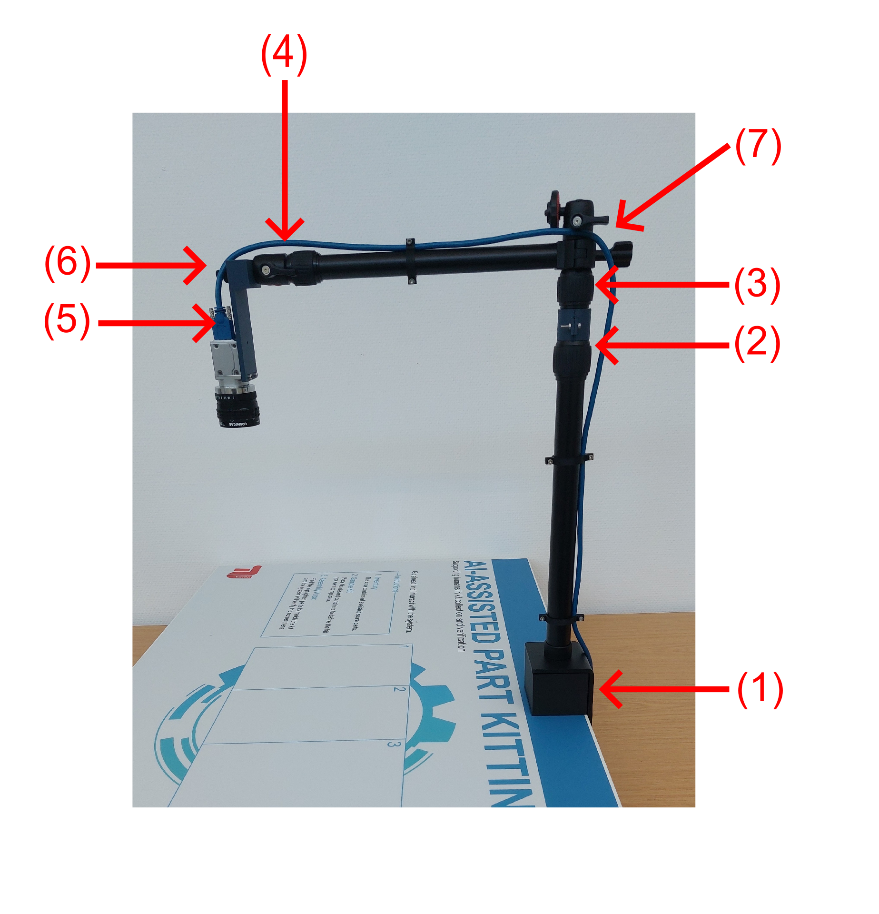
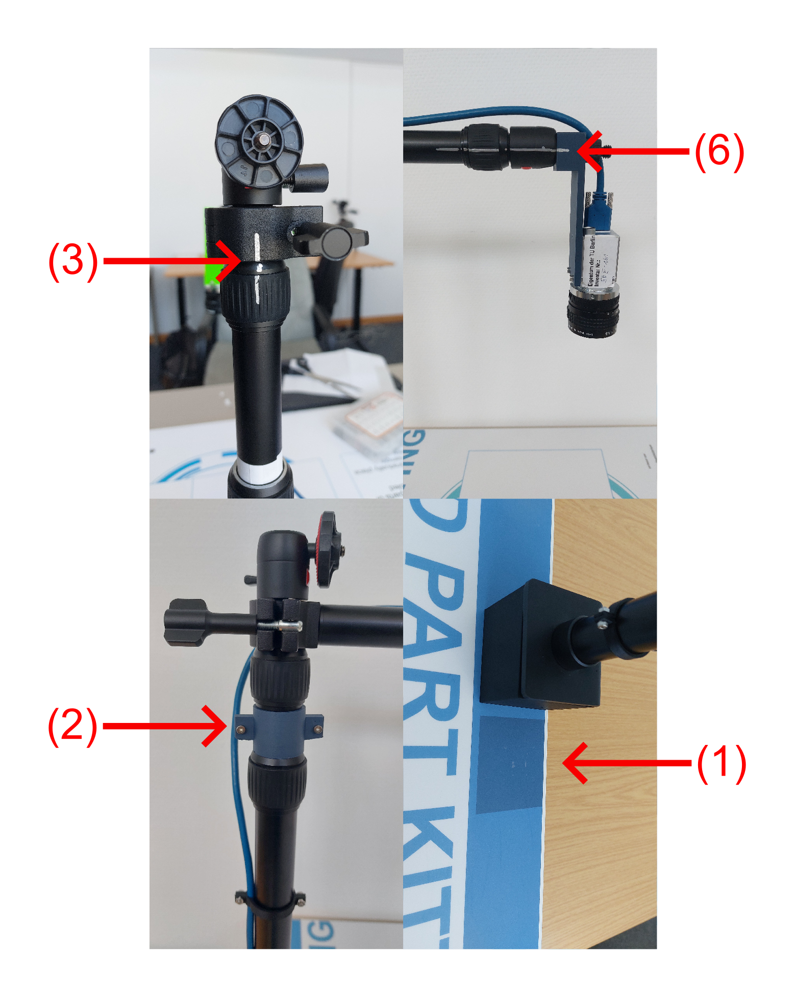
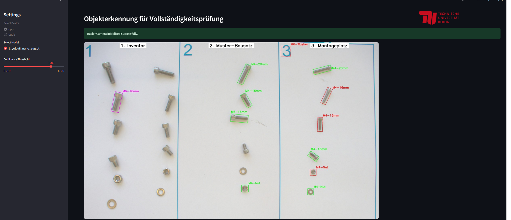
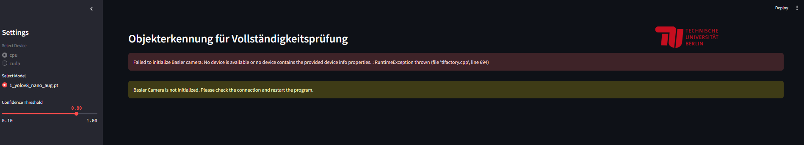
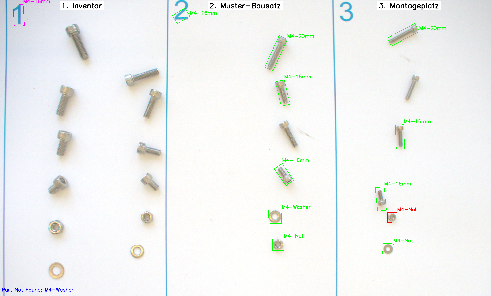
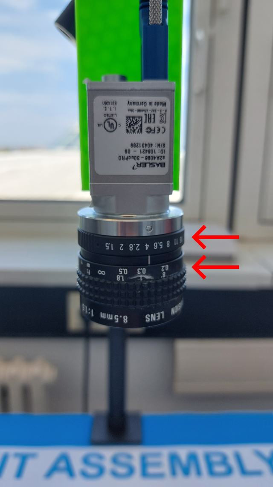

# Setup Guide
First begin by assembling the demonstator as described below, start with the mechnical setup and then proceed with the software setup. Please ensure all steps are followed carefully to guarantee proper installation and functionality of the demonstrator.

## Mechnical Setup
This section provides detailed instructions for the mechanical setup of the demonstrator. Users may choose to follow the step-by-step written guidelines outlined below or refer to the accompanying instructional video for a visual instruction.

### Setup Video Instructions

### Needed Parts for the Mechanical Setup:
- Overhead Tripod
- Camera and USB-Cable
- Table with printed foil or just the loose printed foil
- 3D printed camera mount
- 3D printed height positioner (optional)

### Setting Up the mechanical Demonstrator:
1. Take the overhead tripod and mount it to the table at the marked position on the foil (1).
2. Extend the tripod arm so that height marker is visible (2). Alternatively mount the 3D printed height positioner to find the correct height.
3. Make sure that other arms of the tripod are not extended (3) and (4).
4. Screw the camera to the 3D printed camera mount (5)
5. Mount the camera mount to the tripod (6) and make sure that the marks on the 3D printed camera mount and the tripod are aligned
6. Rotate the tripod arm so that the camera views the 3 field on the foil and the marks at (7) are roughly aligned. Now proceed with the Software Setup and adjust the rotation angle of (7) slightly until it looks good in the Streamlit interface.

## Software Setup
This section outlines the necessary steps to set up the Python environment required to run the machine learning model and the Streamlit interface for the demonstrator. Before proceeding, ensure that the mechanical setup has been completed as described in the previous section. This is essential in order to connect the camera and enable interaction between the Streamlit interface and the demonstrator hardware. Follow the instructions below to properly configure the software environment.
### Setting up the machine learning model and streamlit interface:
1. Clone the repository from [Github](https://github.com/Hergoss/AUT_demonstrator.git)

2. Create the python envrionment:
    - Create a new conda environment with `conda create -n demonstrator_env python=3.9.22` (python version has to be supported by pytorch)
    - For CUDA execution the torch version needs to be adapted according to your NVIDIA Cuda Compiler version(nvcc). Check nvcc version in command with `nvcc --version` and get the pip install code for the corresponding torch version at https://pytorch.org/get-started/locally/
    - For CPU execution get the pip install code for the corresponding torch version at https://pytorch.org/get-started/locally/
    - Download and install the pylon camera driver at https://www.baslerweb.com/de-de/downloads/software/2907135243/
    - Install the other needed python packages via `conda env update -f environment.yml`

3. Connect Camera and run Streamlit Interface:
    - Change to the folder of the repository `cd path/to/appfolder`
    - In cmd prompt run Streamlit via `streamlit run app.py`

4. The Streamlit interface should now be local be available at a local host adress
    - when the camera is correctly connected it should look similar to this and you can proceed:

    - when this error appears the camera is not recognized and you can try to disconnect the camera and connect again or close Streamlit and restart it:

5. Calibrate the brightness and sharpness
    - An example image for good brightness and sharpness looks like this:

    - You can adjust the brightness and sharpness via the camera objective rings (there are two ring sliders).

    - If the brightness and sharpness looks good your done and can start using the demonstrator as shown in the Usage Guide.