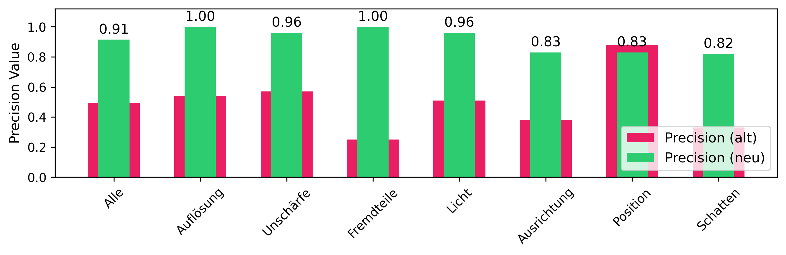
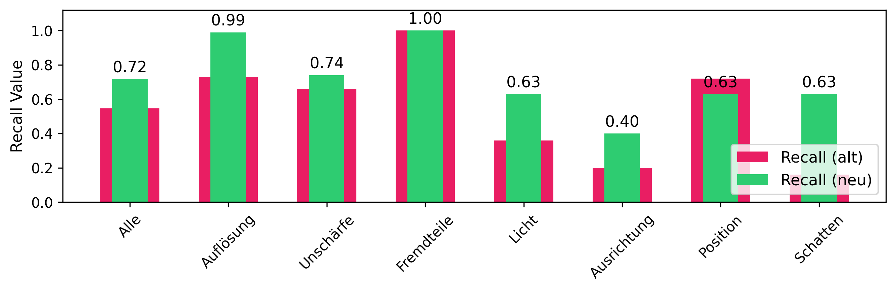
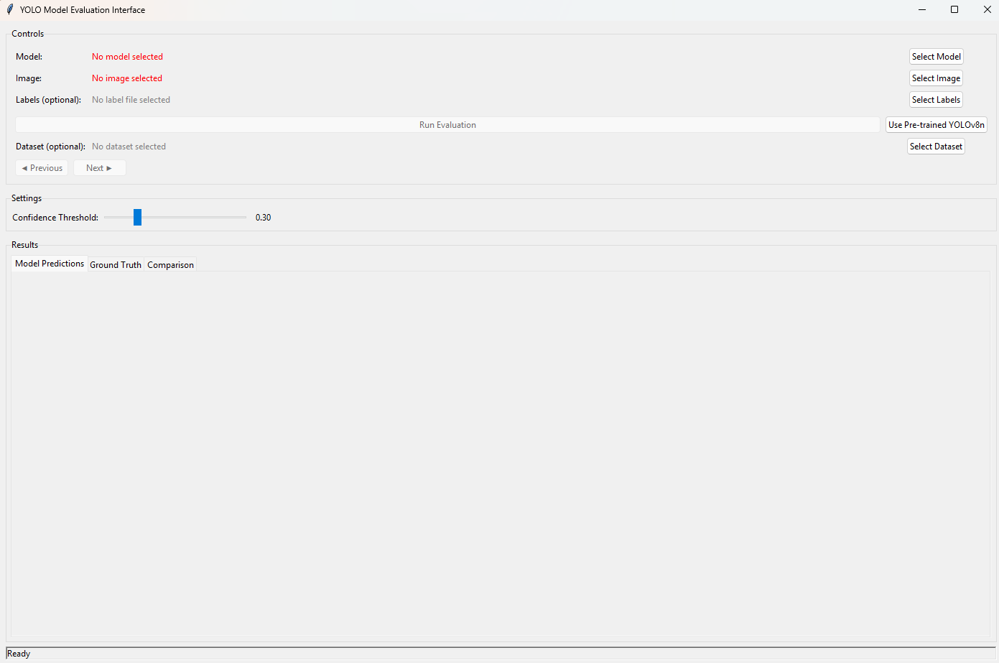
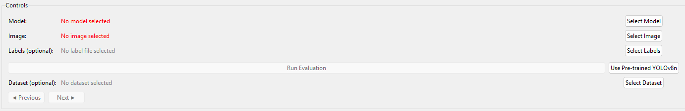
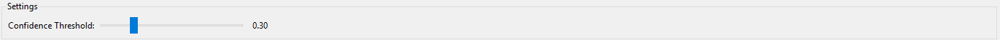
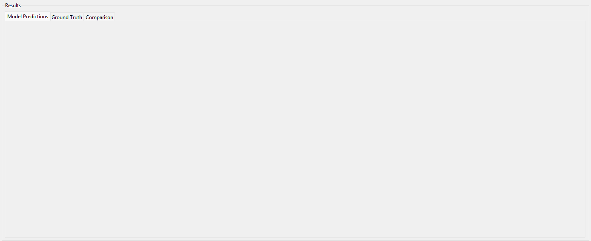
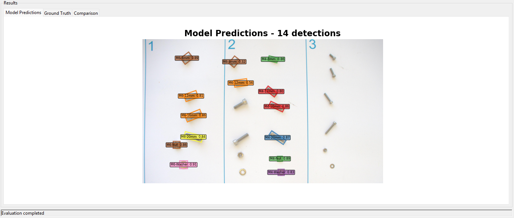
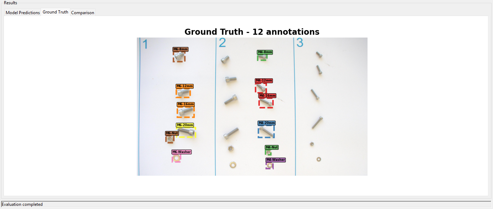
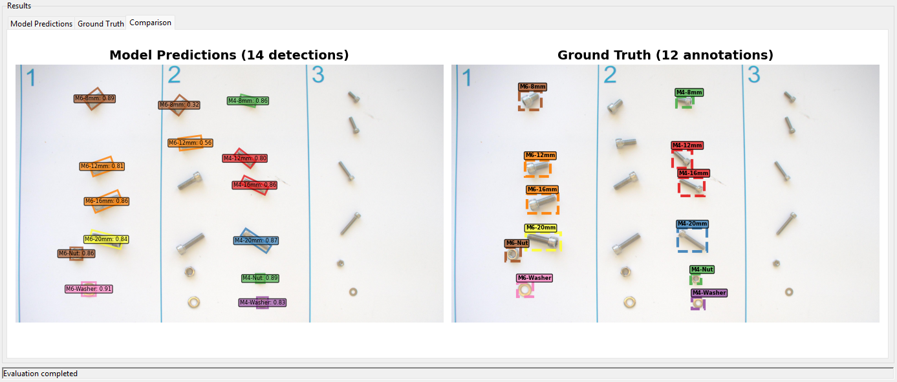
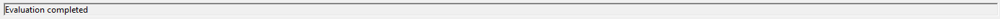

# Training Guide

## Current Performance
The images below illustrate the current precision and recall performance of the model, evaluated using the robstness metrics dataset. These visualizations provide a clear overview of how well the model detects and classifies M4 and M6 screws, nuts, and washers.

## Model Evaluation Interface - User Interface Documentation

### Overview Model Evaluation Interface

The Model Evaluation Interface is a comprehensive GUI application built with Python Tkinter that enables users to evaluate YOLO (You Only Look Once) object detection models. The tool provides visual comparison between model predictions and ground truth annotations, supports dataset browsing, and offers real-time evaluation with adjustable confidence thresholds. It's specifically designed for evaluating custom-trained YOLO models on object detection tasks.

### Interface Components

#### 1. Controls Section

The top section contains all the primary controls for model and data selection.

#### Model Selection
- **Model Path Display**: Shows the currently selected model file or status
- **Select Model Button**: Opens file dialog to choose YOLO model files (*.pt)
- **Use Pre-trained YOLOv8n Button**: Fallback option to use a standard pre-trained model

#### Image Selection
- **Image Path Display**: Shows the currently selected image file
- **Select Image Button**: Opens file dialog to choose image files for evaluation
- **Supported Formats**: JPEG, PNG, BMP, TIFF files

#### Ground Truth Labels (Optional)
- **Label Path Display**: Shows the currently selected label file
- **Select Labels Button**: Opens file dialog to choose YOLO format label files (*.txt)
- **Format Support**: Both bounding box and polygon annotations

#### Dataset Browsing (Optional)
- **Dataset Path Display**: Shows the currently selected dataset YAML file
- **Select Dataset Button**: Opens file dialog to choose dataset configuration files
- **Navigation Controls**: Previous/Next buttons for browsing through dataset images
- **Image Counter**: Shows current position in dataset (e.g., "5 / 100")

##### Action Controls
- **Run Evaluation Button**: Executes the model evaluation process
- **Status**: Enabled only when both model and image are selected

#### 2. Settings Section

Configuration options for model inference parameters.

#### Confidence Threshold
- **Slider Control**: Adjusts detection confidence threshold from 0.1 to 1.0
- **Real-time Display**: Shows current threshold value (e.g., "0.30")
- **Default Value**: Set to 0.3 for balanced detection sensitivity

#### 3. Results Section (Tabbed Interface)

The main display area uses a tabbed interface to show different aspects of the evaluation.

##### Model Predictions Tab
- **Visual Display**: Shows original image with model predictions overlaid
- **Bounding Boxes**: Color-coded detection boxes
- **Class Labels**: Object class names with confidence scores
- **Detection Count**: Total number of detections in title

##### Ground Truth Tab
- **Visual Display**: Shows original image with ground truth annotations
- **Annotation Boxes**: Dashed-line boxes for ground truth objects
- **Class Labels**: True object class names
- **Annotation Count**: Total number of ground truth objects

##### Comparison Tab
- **Side-by-Side View**: Model predictions on left, ground truth on right
- **Visual Comparison**: Direct comparison of detection vs. annotation accuracy
- **Synchronized Scaling**: Both views maintain same image scale and positioning

#### 4. Status Bar

The bottom status bar provides real-time feedback about application operations.

**Information Displayed:**

- Loading status for models and images
- Inference progress updates
- Error messages and warnings
- Operation completion confirmations
- Dataset loading progress

### Supported File Formats

#### Model Files
- **PyTorch Models**: *.pt files (YOLO format)
- **Pre-trained Models**: YOLOv8n, YOLOv11 variants
- **Custom Models**: User-trained YOLO models

#### Image Files
- **JPEG**: *.jpg, *.jpeg
- **PNG**: *.png
- **BMP**: *.bmp
- **TIFF**: *.tiff, *.tif

#### Label Files
- **YOLO Format**: *.txt files
- **Bounding Box Format**: `class_id x_center y_center width height`
- **Polygon Format**: `class_id x1 y1 x2 y2 x3 y3 ...` (for oriented bounding boxes)

#### Dataset Files
- **YAML Configuration**: *.yaml, *.yml files
- **Standard Structure**: Compatible with YOLO dataset format

### Class Names Support

The interface supports 14 predefined object classes:

**M4 Series:**
- M4-8mm, M4-12mm, M4-16mm, M4-20mm
- M4-Nut, M4-Washer

**M6 Series:**
- M6-8mm, M6-12mm, M6-16mm, M6-20mm
- M6-Nut, M6-Washer

**Special Components:**
- Standing-Nut, Standing-Screw

### Usage Workflow

#### Basic Model Evaluation

**1. Load Model**

- Click "Select Model" button to choose a trained YOLO model
- Alternatively, click "Use Pre-trained YOLOv8n" for testing with a standard model
- Verify model loads successfully (green text indicates success)

**2. Select Image**

- Click "Select Image" button to choose an image for evaluation
- Navigate to your test images directory
- Select desired image file for analysis

**3. Configure Settings**

- Adjust confidence threshold using the slider
- Higher values (0.7-0.9) for stricter detection
- Lower values (0.1-0.3) for more sensitive detection

**4. Run Evaluation**

- Click "Run Evaluation" button to start the analysis
- Wait for inference to complete
- Review results in the "Model Predictions" tab

#### Advanced Workflow: With Ground Truth Comparison

**1. Prepare Ground Truth**

- Click "Select Labels" button to load ground truth annotations
- Choose corresponding *.txt file with YOLO format labels
- Ensure label file matches the selected image

**2. Run Evaluation with Comparison**

- Follow basic evaluation steps above
- After evaluation completes, review all three tabs:
  - Model Predictions: See what the model detected
  - Ground Truth: See the correct annotations
  - Comparison: Side-by-side visual comparison

**3. Analyze Results**

- Compare detection accuracy between predicted and actual objects
- Identify missed detections (false negatives)
- Identify incorrect detections (false positives)
- Assess class classification accuracy

#### Dataset Browsing Workflow

**1. Load Dataset**

- Click "Select Dataset" button
- Choose dataset YAML configuration file
- Wait for dataset to load and validate image paths

**2. Browse Images**

- Use "Previous" and "Next" buttons to navigate through dataset images
- Monitor image counter for current position
- Ground truth labels load automatically when available

**3. Systematic Evaluation**

- Evaluate model performance across multiple images
- Identify patterns in detection accuracy
- Assess model performance on different object types or backgrounds

