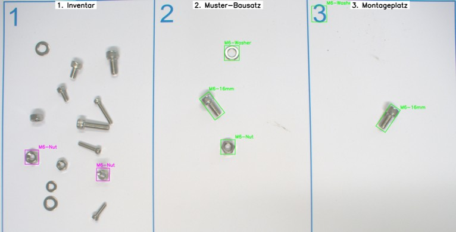
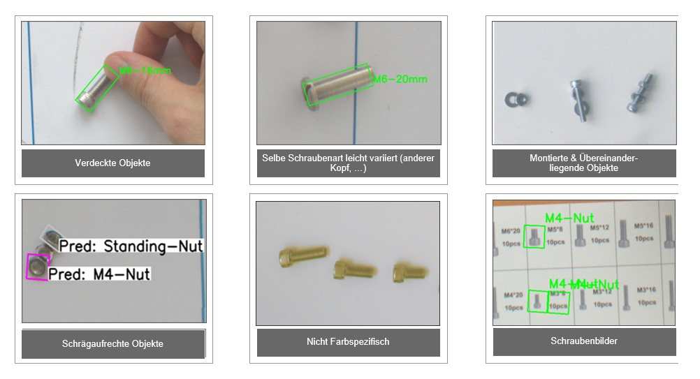

# How to use the demonstrator:
 
<iframe width="560" height="315" src="https://www.youtube.com/embed/JQBySkXoCaU"
        title="YouTube video player" frameborder="0"
        allow="accelerometer; autoplay; clipboard-write; encrypted-media; gyroscope; picture-in-picture"
        allowfullscreen></iframe>

 
## Written Instructions of the Demonstrator 

### Field One: The Inventory
This field contains a set of components such as screws, nuts, and washers, which can be used to assemble a desired kit.

### Field Two: The Sample Kit
In this field, the user defines a sample assembly. The AI then identifies where the required components for the assembly are located in Field One. In the example image an M6 screw, an M6 nut, and an M6 washer.

### Field Three: The Assembly Area
This field allows the AI to check whether all necessary parts are present or if something is missing. In this example, the M6 nut is missing. The user is then guided to Field One, where the missing M6 nut is highlighted, so it can be placed in Field Three.  

This way, the user can efficiently gather all required parts in the assembly area and start the assembly process with all components in place.

### Overview Image

## Known Edge Cases

Currently several problem cases remain, as shown above, which must be considered as limitations of the current implementation:

- **Obscured or overlapping parts:** If parts are not visible in the image, the model lacks the necessary information. In these cases, the model reacts conservatively and usually does not output a prediction.

- **Variations in screw types:** Although the models were trained on hex screws, they also classify other screw heads (e.g., slotted screws) as valid parts due to their similarity, which is not desirable in all use cases.

- **Tilted or upright parts:** With the introduction of classes like **Standing-Screw** and **Standing-Nut**, questions arise about the definition of when a part is considered upright.

- **Color specificity:** Currently, the model does not differentiate screw colors. Depending on the application, this may become necessary in the future.

- **Screw image material:** Images showing screws sometimes lead to misclassifications due to their high similarity to real parts.
